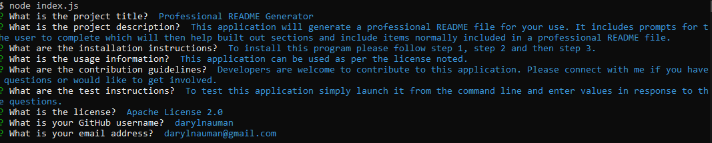
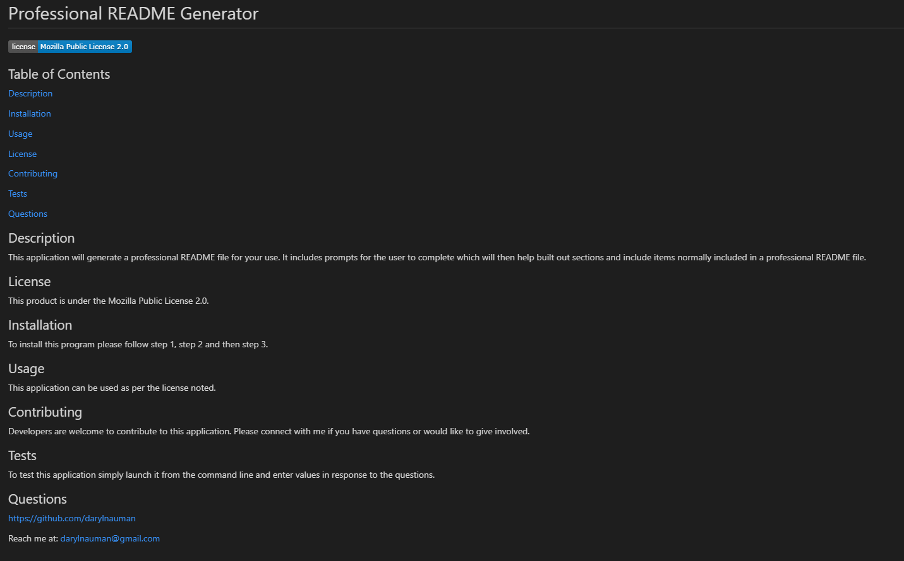

# Homework Assignment - 09 Node.js: Professional README Generator

## Table of Contents
[Description](#description)

[Key Features](#key-features)

[License](#license)

[Questions](#questions)

[Walkthrough Video](#walkthrough-video)

[Screenshots](#screenshots)

## Description
The focus of this homework assignment for the University of Toronto SCS Coding Boot Camp was to allow the user to quickly and easily create a README file using a command-line application. This application uses Node.js to dynamically create one. Limited starter code was provided.

## Key Features
- Inquirer package available from [npm](https://www.npmjs.com/) allows for the command line prompts and user responses to be captured
- Prompts have different ways of capturing the user responses, for example, some questions will have the user type in a response while another will have them select a response from a list of options provided
- File system module from Node.js is used to create and write to a file
- README file created includes a license badge, a table of contents, sections, and contact information for the creator
- Content of the README file follows a structure and includes content that is dynamically populated based on the user responses
- Shields IO is used to create different badges based on the license the user selects for their application

## Walkthrough Video
The following video demonstrates the application's functionality.
<iframe src="https://drive.google.com/file/d/14n5pGMXgMRUrhT9ikEGAZ_5o7tGwe19_/preview" width="640" height="480"></iframe>

## License
This product is under the MIT License.

## Questions
https://github.com/darylnauman
 
Reach me at: darylnauman@gmail.com

## Screenshots
The images below show aspects of the application including the prompts at the command line for the user and a sample README file.

